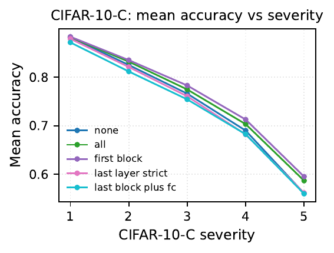
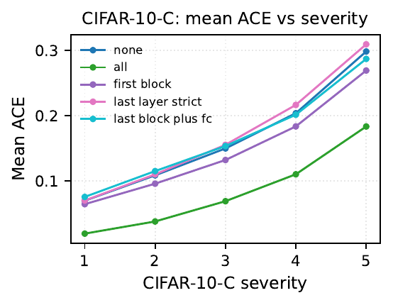
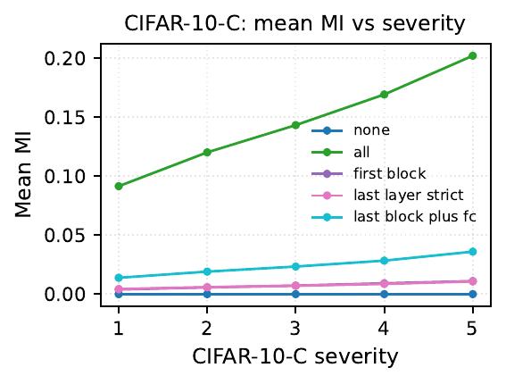
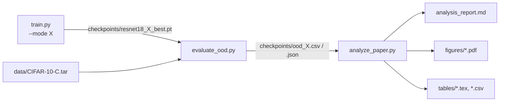

# CIFAR-10 MC Dropout OOD

**Where in a ResNet should Monte Carlo dropout live? This project trains a CIFAR-10 ResNet-18 under five different dropout placements and measures accuracy, calibration, and epistemic uncertainty on CIFAR-10-C.**

[](https://github.com/nathan215/cifar10-mc-dropout-ood-/actions/workflows/ci.yml)
[](https://www.python.org/downloads/)
[](LICENSE)

## Why

Convolutional networks are often overconfident under input corruption, and Monte Carlo (MC) dropout is a cheap way to get uncertainty estimates from a single trained network without a full ensemble. But it is unclear which layers should actually stay stochastic at inference: some recent work argues that treating only the final layer as Bayesian is enough to fix overconfidence while preserving learned features, but that claim is largely untested under severe distribution shift.

This repo runs a controlled ablation to check it directly: one training recipe, five dropout placements (none, all residual blocks, first block only, last layer only, last block + head), evaluated on CIFAR-10-C so the comparison is about robustness to corruption, not just clean-test accuracy.

## Results

Mean over all evaluated CIFAR-10-C corruption types at each severity. `T = 50` MC forward passes for the four dropout modes, `T = 1` for the deterministic `none` baseline (so its MI is 0 by construction). Figures generated by `analyze_paper.py` from the per-corruption evaluation CSVs.

<p align="center">



</p>

**Key findings** (numbers from Section 4.3 of `Project.tex`, severity 5):

- **Dropout in all residual blocks is the only placement that stays calibrated under heavy corruption.** Its mean ACE at severity 5 is about 0.18, against 0.27 to 0.31 for every other mode, and it is the only mode with substantial epistemic disagreement between MC passes (mean MI about 0.20; the next highest, `last_block_plus_fc`, stays below 0.04).
- **Accuracy and uncertainty signal are different things.** Dropout in the first block only gives the highest mean accuracy at severity 5 (about 0.60) but an MI an order of magnitude below `all`: its MC passes barely disagree even though the model is miscalibrated.
- **"Last layer is enough" does not survive severe pixel-level shift.** `last_layer_strict` has the worst mean ACE (about 0.31), slightly worse than the deterministic baseline (about 0.30): once the deterministic trunk has degraded the features, perturbing only the head does not help.
- Accuracy differences between placements stay within about 4 pp at every severity, so the placement decision is about calibration and uncertainty, not accuracy.

The per-mode, per-corruption breakdown (`results_discussion_detail.md`, `tables/`) is regenerated by `analyze_paper.py` from the evaluation CSVs and is not checked in.

## Method

**Architecture.** A CIFAR-style ResNet-18 (`models.py`): the standard ImageNet 7x7 convolutional stem and max-pooling are replaced with a 3x3 stride-1 convolution and an identity mapping, keeping the full 32x32 spatial resolution through the stem.

**Dropout placement modes** (`MODE_CONFIG` in `models.py`; `Dropout2d`/`Dropout`, `p = 0.3`):

| Mode | `Dropout2d` in residual stages | `Dropout` before FC |
|---|---|---|
| `none` | none | no |
| `all` | layer1, layer2, layer3, layer4 | yes |
| `first_block` | layer1 only | no |
| `last_layer_strict` | none | yes |
| `last_block_plus_fc` | layer4 only | yes |

At inference, `enable_mc_dropout()` puts the model in `eval()` mode (frozen BatchNorm running stats) and then explicitly switches only the `Dropout`/`Dropout2d` modules back to `train()` — this avoids BatchNorm picking up batch-level statistics during MC sampling, which would otherwise inflate apparent noise.

**Metrics** (`metrics.py`), computed from `T` softmax samples per image:

- **Mutual information (MI)** — epistemic uncertainty: `H(mean prediction) − mean_t H(prediction_t)`.
- **Brier score** — for each sample, the sum over classes of the squared error between the mean predictive distribution and the one-hot label, then averaged over samples.
- **Adaptive Calibration Error (ACE)** — sort predictions by confidence, split into `M = 15` equal-count bins, take the unweighted mean of `|accuracy − confidence|` across bins (more robust than fixed-width ECE bins when confidence is skewed).

**Evaluation protocol.** Each trained checkpoint is run against every corruption type in CIFAR-10-C (`evaluate_ood.py`) at all 5 severities; `analyze_paper.py` expects the full benchmark (19 corruption types x 5 severities = 95 rows per mode) when aggregating.



## Quickstart

```bash
pip install -r requirements.txt
```

Requires Python 3.10+. `requirements.txt` does not pin a CUDA build; for GPU training, install a CUDA-enabled `torch` per [pytorch.org](https://pytorch.org/get-started/locally/) before or instead of the plain `pip install torch`. CI and the unit tests below run on CPU-only PyTorch.

**1. Train one mode** (CIFAR-10 downloads automatically via `torchvision` into `--data-root`):

```bash
python train.py --mode all --data-root ./data --out-dir ./checkpoints --epochs 100 --device cuda
```

`--mode` is required, one of `none`, `all`, `first_block`, `last_layer_strict`, `last_block_plus_fc`. Use `--device cpu` without a GPU. On Windows, `train_remaining.ps1` loops this over `last_layer_strict`, `last_block_plus_fc`, `none` (assumes `all` was already trained).

**2. Get CIFAR-10-C.** Download the official archive — Hendrycks & Dietterich, 2019, hosted on Zenodo, [record 2535967](https://zenodo.org/record/2535967) — and place it at the fixed path `evaluate_ood.py` expects:

```
data/CIFAR-10-C.tar
```

**3. Evaluate OOD** from a checkpoint (runs all corruptions in the tar at all 5 severities, `T = 50` MC forward passes by default):

```bash
python evaluate_ood.py --checkpoint checkpoints/resnet18_all_best.pt --mc-samples 50 --device cuda
```

Writes `checkpoints/ood_<mode>.csv` and `.json`. Add `--save-diagnostics fog,gaussian_noise` to also dump per-corruption reliability-bin/entropy tensors for plotting. On Windows, `evaluate_all.ps1` runs this for `all`, `first_block`, `last_layer_strict`, `last_block_plus_fc` (not `none`) against their expected checkpoints.

**4. Aggregate and analyze:**

```bash
python analyze_paper.py
```

Reads every `checkpoints/ood_*.csv` and `resnet18_*_history.json`, sanity-checks them, and writes `analysis_report.md`, `results_discussion_detail.md`, `figures/*.pdf`, and `tables/*.tex`/`*.csv`.

**5. Run the unit tests** (CPU-only, a few seconds):

```bash
python -m pytest -q
```

## Repository layout

| Path | Purpose |
|---|---|
| `train.py` | Train one dropout mode; saves the best-val-loss checkpoint and a training-history JSON |
| `evaluate_ood.py` | MC-dropout OOD evaluation on CIFAR-10-C (`data/CIFAR-10-C.tar`); writes per-corruption/per-severity CSV + JSON |
| `analyze_paper.py` | Aggregates OOD CSVs and training histories, sanity-checks them, writes the report, figures, and tables |
| `models.py` | CIFAR ResNet-18 and the five dropout-placement modes (`MODE_CONFIG`) |
| `dataset.py` | CIFAR-10 loaders and CIFAR-10-C tar/`.npy` loaders |
| `metrics.py` | Mutual information, Brier score, ACE, and reliability-bin helpers |
| `runtime_utils.py` | Device resolution, batch transfer, JSON/CSV writers |
| `Project.tex`, `egbibfinal.bib` | Full write-up and bibliography |
| `train_remaining.ps1`, `evaluate_all.ps1` | Windows PowerShell convenience wrappers around `train.py` / `evaluate_ood.py` |
| `tests/` | Pytest unit tests for `metrics.py` |
| `.github/workflows/ci.yml` | GitHub Actions: install CPU-only PyTorch, run pytest on every push/PR |
| `checkpoints/`, `figures/`, `tables/` | Generated experiment artifacts (git-ignored except `.gitkeep`) |
| `data/` | Local datasets (git-ignored entirely) |
| `requirements.txt` | Python dependencies |
| `LICENSE` | MIT license |

## Report

The full write-up — introduction, related work, method details, and discussion — is in [`Project.tex`](Project.tex) ("Layer-Wise Epistemic Ablation: Quantifying Structural Uncertainty in Convolutional Neural Networks under Distribution Shift", Chen-Yi Su, Johns Hopkins University).

## References

- Gal, Y. and Ghahramani, Z. (2016). *Dropout as a Bayesian Approximation: Representing Model Uncertainty in Deep Learning.* ICML.
- Hendrycks, D. and Dietterich, T. (2019). *Benchmarking Neural Network Robustness to Common Corruptions and Perturbations.* ICLR. (CIFAR-10-C dataset)

Additional related work is cited in `Project.tex` / `egbibfinal.bib`.

## License

MIT — see [LICENSE](LICENSE).
